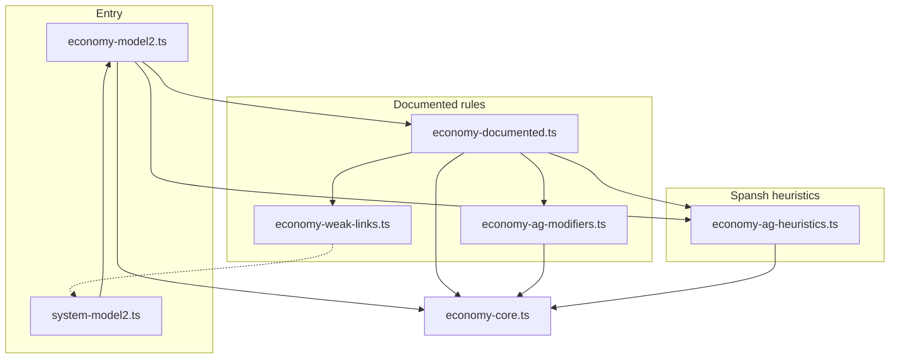

# Economy model file structure

This document describes how colonization economy calculation is organized in `src/`. The model estimates per-port economy strengths (shown as percentages in the UI) and compares them to Spansh where available.

**Public entry point:** import from `economy-model2.ts` (re-exports are kept for backward compatibility).

**System integration:** `system-model2.ts` builds link graphs, then calls `calculateColonyEconomies2` for ports/settlements and `calculateFacilityEconomies2` for hubs/installations with a fixed `type.inf`.

---

## Hubs and installations

| Role | Behavior |
|------|----------|
| **Economy-bearing hub** (`type.inf` set, e.g. athena → hightech) | Fixed intrinsic via [`economy-facilities.ts`](../src/economy-facilities.ts); no strong/weak link math on the hub itself (Spansh treats these as fixed facility economies). |
| **athena (scientific hub)** | 100% hightech by default; **140%** when the same body has an **operational** comms installation (`aletheia` with journal `marketId` ≥ 4_200_000_001). Body BIO/GEO hightech buffs do not apply to facility hubs. |
| **Link-only installation** (`type.inf === none`, e.g. aletheia) | No own economy row; subordinates under the body primary (port or hub) and can unlock hub intrinsics / strong links for ports. |
| **Weak-link sources** | Ports, settlements, and subordinate hubs — not installations (installations use **strong** links only when subordinate to a port/hub). |

Planning: once a hub and its prerequisites are in `calcIds` as complete sites, the model shows the same percentages Spansh will report after construction.

---

## Module map

| File | Layer | Purpose |
|------|-------|---------|
| [`economy-facility-registry.ts`](../src/economy-facility-registry.ts) | Facilities | Spansh registry: per–build-type intrinsics and link-only rows |
| [`economy-facilities.ts`](../src/economy-facilities.ts) | Facilities | Applies registry intrinsics in `calculateFacilityEconomies2` |
| [`economy-model2.ts`](../src/economy-model2.ts) | Pipeline | Orchestrates calculation order; re-exports the public API |
| [`economy-core.ts`](../src/economy-core.ts) | Shared | `adjust`, `matches`, `bodyIsTidalToStar`, constants, agriculture calc flags |
| [`economy-documented.ts`](../src/economy-documented.ts) | Documented rules | Body intrinsics, buffs, strong/weak links, specialized ports |
| [`economy-ag-modifiers.ts`](../src/economy-ag-modifiers.ts) | Documented (ag) | Single table of ±0.4 agriculture body modifiers |
| [`economy-ag-heuristics.ts`](../src/economy-ag-heuristics.ts) | Spansh alignment | Agriculture caps, floors, filters, presets — not in community sheet |
| [`economy-weak-links.ts`](../src/economy-weak-links.ts) | Documented (links) | Which sites count as weak-link sources (subordinate tiered stations) |
| [`system-model2.ts`](../src/system-model2.ts) | Link graph | Primary ports, strong/weak site lists, `buildSystemModel2` |

---

## Dependency graph



`economy-core.ts` only imports **types** from `system-model2.ts` where needed, avoiding circular runtime imports.

---

## Calculation pipeline

`calculateColonyEconomies2(site, calcIds, options)` runs in this order:

1. **Reset** — clear `economyAudit`; reset `site.agEconomyCalc` flags
2. **Settlements** — fixed 1.0 in primary economy + body buffs → done
3. **Specialized ports** (`site.type.fixed`) — baseline 0.5 surface / 1.0 orbital + buffs
4. **Colony ports** — `applyBodyType` (intrinsics) → `applyBuffs` → `applyObservedPresetEconomies` (heuristic)
5. **Links** (if `site.links` exists):
   - `applyStrongLinks2` — same-body strong links (+ sub-strong links from facilities)
   - `applyWeakLinks` — system-wide weak links (+ agriculture cap/filter heuristics)
   - `applyFixedSurfaceAgricultureFloor` / `applyOrbitalFixedNonAgAgricultureFloor` (heuristic)
6. **Finish** — sort economies, set `primaryEconomy`, optional audit sort

Link data is populated earlier by `buildSystemModel2` → `calcBodyLinks` / `assignBodySubordinateLinks` in `system-model2.ts`.

---

## Documented vs heuristic rules

### Documented (`economy-documented.ts`, `economy-ag-modifiers.ts`, `economy-weak-links.ts`)

Based on community research (e.g. ED Colonization Economic Effects spreadsheet) and in-code comments:

- Colony body intrinsics by body type and features (`applyBodyType`)
- Body buffs: reserve level, bio/geo, ELW/WW, icy, tidal, volcanism, stellar tourism (`applyBuffs`, `applyStrongLinkBoost`)
- Strong link tiers: 0.4 / 0.8 / 1.2
- Agriculture strong-link modifiers via `AGRICULTURE_BODY_MODIFIER_RULES` (±0.4, 0.1 floor on strong links)
- Weak links: +0.05 per qualifying source
- Specialized port baselines (0.5 / 1.0)
- Subordinate-only weak links for T1/T2/T3 starports (`siteContributesWeakLinks`)

### Heuristic (`economy-ag-heuristics.ts`)

Empirical rules added to match Spansh snapshots. **Not** in the public colonization sheet:

| Mechanism | Examples |
|-----------|----------|
| `AG_WEAK_LINK_BUDGET` / `AG_WEAK_LINK_BUDGET_RULES` | Percent budgets (90%, 110%, …) → `floor(budget / 0.05)` link steps |
| Agriculture floors | Surface industrial → 100% if linked ag ≥ 55%; orbital non-ag → 65% |
| Weak-link filters | Skip distant ag+tourism colony hubs; foreign-star limit |
| `applyObservedPresetEconomies` | Atropos on icy without bio |
| `getColonyAgricultureStrongLinkSourceValue` | Same-body colony ag strong-link scaling (Grace-fo, Hololive) |

When adding behavior, prefer extending the **documented** modules unless Spansh regression requires a heuristic.

---

## Agriculture-specific structure

Agriculture is split across three files on purpose:

```
economy-ag-modifiers.ts   → WHAT modifiers apply (single rule table)
economy-documented.ts     → WHEN they apply (body buff vs strong link path)
economy-ag-heuristics.ts   → HOW MUCH weak linking is allowed (percent budgets → link steps)
```

**Calc flags** (`site.agEconomyCalc`, set in `economy-core.ts`):

| Flag | Set when | Used for |
|------|----------|----------|
| `tier1ColonyAgStrongLink` | T1 colony applies an ag strong link | Hab-world weak-link cap (11) |
| `sameBodyAgFacilityStrongLink` | Same-body demeter/picumnus (etc.) ag strong link | Weak-link cap (3) |
| `sameBodyAgSettlementStrongLink` | Same-body ceres/fornax ag strong link | Weak-link cap (22) |
| `sameBodyColonyAgStrongLink` | Same-body colony ag strong link | Weak-link cap (1) on non-hab worlds |

Flags replace parsing `economyAudit` reason strings for cap logic.

---

## Options and UI toggles

```typescript
interface EconomyModelOptions {
  enableTerraformableAgricultureBonus?: boolean; // default: false
}
```

Passed from `SystemView2` via `buildSystemModel2(..., economyModelOptions)`. Persisted in local storage as `terraformableAgriBonus`.

---

## Link graph vs economy calculation

Two related concepts that are easy to conflate:

| Concept | Where | Role |
|---------|-------|------|
| **Link graph candidate pool** | `SiteMap2.links.weakSites` / `strongSites` | Built in `calcSiteLinks` — every qualifying facility on other bodies |
| **Link graph score** | `MarketLinks.tsx` bar width | `strong × 62 + weak × 8` per economy — **UI display only**, not used in `calculateColonyEconomies2` |
| **Weak-link budget** | `economy-ag-heuristics.ts` | Percent cap on agriculture weak-link accumulation (+5% steps) |
| **Applied weak links** | `applyWeakLinks` in `economy-documented.ts` | Sorted candidates until budget exhausted; capped candidates appear in audit as **Skipped weak link** (delta 0) |

**Per-port weak-link budgets (2026-05):** Spansh regression on HR 4464 B showed agriculture differs by port **buildType** and **orbital subordinate count**, not exclusive facility assignment. Production applies `AG_WEAK_LINK_BUDGET_BY_BUILD_TYPE` (e.g. hestia → 160%) and `getOrbitalClusterAgWeakLinkBudget` for plutus/vulcan/prometheus (0 subs → 90%, 1–2 subs → 140%, 3+ subs → 115%). The link graph still lists all system candidates; budgets cap how many apply. Remaining gap: surface ports like Roughly (hestia) may still miss Spansh when foreign-star weak-link filtering limits eligible sources.

### API / save investigation (2026-05)

| Source | Per-port weak link data? |
|--------|--------------------------|
| RC API `Sys` schema v6 (`/api/v2/system/...`) | **No** — sites only have `id`, `buildId`, `marketId`, `name`, `bodyNum`, `buildType`, `status` |
| Spansh station API | **No** — economy shares only, no linked-facility list |
| RC inferred link graph | Full system candidate pool + same-body strong subs |

**Proof:** On HR 4464 B body 8, `Romarzs Refinery Recycles` (Spansh 115%) and `Roughly Reinforced Rock Refinery Refuge` (Spansh 160%) share a body but differ by 45% agriculture — so the gap is **per-port**, not body-level rules.

**Prepared for future data:** optional `Site.weakLinkIds?: string[]` — when present, `calcSiteLinks` filters `weakSites` to that subset before economy calc. Market links UI shows `applied/candidates` for weak counts when the budget caps application (e.g. `18/35`).

**Backend ask:** persist player-configured weak link source ids per port (Colonial Architect export or RC schema v7+) so agriculture estimates can match Spansh without reverse-engineering each port individually.

Use `explainAgricultureWeakLinkBudget()` and `getImpliedAgricultureWeakLinkBudget()` for debugging in the app or devtools.

---

## Local verification (not in git)

Spansh regression and unit tests live under `src/dev/economy/` on your machine only (gitignored). Run with `npm run test:economy` when that folder is present.

---

## Where to change things

| Goal | File |
|------|------|
| New body type intrinsic | `economy-documented.ts` → `applyBodyType` |
| New ±0.4 agriculture modifier (all paths) | `economy-ag-modifiers.ts` → `AGRICULTURE_BODY_MODIFIER_RULES` |
| New strong-link tier / colony propagation | `economy-documented.ts` → `applyStrongLinks2` |
| New weak-link source rule | `economy-weak-links.ts` and/or `system-model2.ts` link assignment |
| New Spansh-fitting agriculture cap/floor | `economy-ag-heuristics.ts` → `AG_WEAK_LINK_BUDGET` / `AG_WEAK_LINK_BUDGET_RULES` or floor functions |
| Change calculation order | `economy-model2.ts` only |
| UI comparison / display | `EconomyTable2.tsx`, `SystemView2.tsx` |

---

## Related types (`system-model2.ts`)

- `SiteMap2.economies` / `primaryEconomy` — calculation output
- `SiteMap2.economyAudit` — step-by-step audit trail for the economy table
- `SiteMap2.intrinsic` — body-driven colony economies (for weak-link counting)
- `SiteMap2.links.strongSites` / `weakSites` — link graph inputs
- `SiteMap2.agEconomyCalc` — per-run agriculture cap flags
